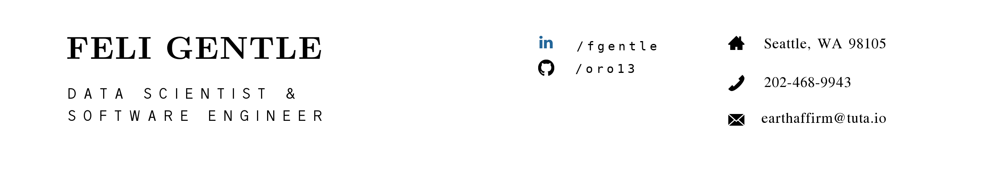

---

### Hey there, I'm Feli 👋😄 

I'm a data scientist, machine learning engineer, experienced with full stack production. I'm also a practioner & evangelist of Bayesian statistics.

#### Tools:

Python

- sklearn
- tensorflow/probability (neural networks, structural time series)
- pymc3
- gradient boosting (xgboost, catboost, lightgbm)
- pyspark
- airflow

Javascript

- react
- vue
- typescript
- tensorflow.js
- d3

Dashboard/BI Tools

- Tableau
- PowerBI
- Apache Superset

Rust

- Holochain
- Tensorflow Rust
- Hugging Face

I also speak SQL and R and learning Haskell!

Feel free to reach out here or on [linkedin](https://www.linkedin.com/in/fgentle/)

#### Recent Projects:

Consulting the City of Seattle on road safety. We're using machine learning predictive models and statistical modeling to analyze traffic collision data. I'm using Bayesian decision theory to make policy recommendations based on our findings and optimizing for efficient use of city resources. Check it out [here](https://github.com/DataCircles/traffic_collisions_ml_team1)! 

I'm compiling and creating learning resources for Bayesian data analysis and science, called the [Bayesian Mixtape](https://github.com/oro13/bayesian-mixtape)

I contribute to numerous opensource projects, including [Holo-REA](https://github.com/holo-rea/holo-rea) for a post-blockchain operations/accounting library.

I've also contributed to a variety of ML prototypes including a [language learning app](https://github.com/oro13/language-app-ml), a [soil nutrition predictor](https://github.com/oro13/soil-health-prediction), [auction price predictions](https://github.com/oro13/a-bulldozer-named-desire/), [fraudulent activity detection dashboard](https://github.com/oro13/fraud-detection), user specific content recommenders, NLP analysis, ecommerce, and so on.

Also, check out my [blog on DS and Bayesian inference for science and business](https://fgentle.github.io/blog/blog.html) (WIP), and [project portfolio](https://fgentle.github.io/portfolio/portfolio.html).

<!--

**oro13/oro13** is a ✨ _special_ ✨ repository because its `README.md` (this file) appears on your GitHub profile.

Here are some ideas to get you started:

- 🔭 I’m currently working on ...
- 🌱 I’m currently learning ...
- 👯 I’m looking to collaborate on ...
- 🤔 I’m looking for help with ...
- 💬 Ask me about ...
- 📫 How to reach me: ...
- 😄 Pronouns: ...
- ⚡ Fun fact: ...
-->
